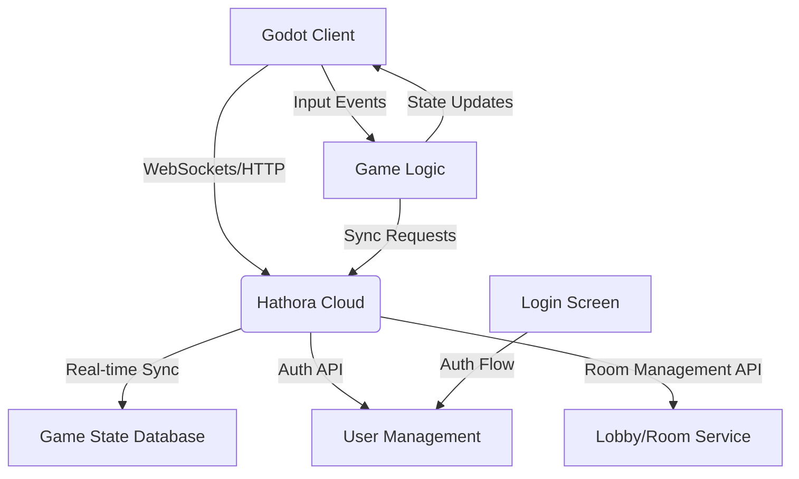

# Online Game Architecture with Godot and Hathora

## Overview
This architecture integrates Godot (client) with Hathora's backend services to implement real-time multiplayer, authentication, and configurable game types with color assignment.

## Components

1. **Godot Client**
   - Game scenes (lobby, gameplay)
   - Input handling and local prediction
   - UI for user profiles and room configuration
   - Hathora SDK integration for backend communication
   - **New Components**:
	 - Player class with color assignment
	 - Color selection UI
	 - Game type configuration interface

2. **Hathora Services**
   - **Real-time Sync**: Maintain authoritative game state
   - **User Auth**: Email/password and social login support
   - **Room Management**:
	 - Persistent room state with host election
	 - Host privileges: start game, kick players, update settings
	 - Room code sharing for direct invitations
	 - **New Features**:
	   - Game type configuration (Deathmatch, CaptureTheFlag, TeamElimination)
	   - Color assignment system with uniqueness constraint

## Data Flow

1. **Authentication**
   - Client → Hathora Auth API → User verification → Token issuance

2. **Game Sync**
   - Client sends inputs → Hathora processes → Updates game state → Broadcasts to all clients

3. **Color Assignment**
   - Client requests color → Hathora Room Service checks availability → Assigns unique color → Updates room state

## Lobby/Room System Requirements

1. **Room Persistence**: Rooms remain active in server memory even if host disconnects
2. **Host Management**:
   - Automatic host election on room creation
   - Host privileges: start game, kick players, update room settings
3. **Invitation System**:
   - Shareable room codes via email/social media
   - Direct invites through user profiles
4. **Dynamic Capacity**:
   - Configurable room size (2-16 players)
   - Real-time capacity updates
5. **Game Configuration**:
   - Selectable game types (Deathmatch, CaptureTheFlag, TeamElimination)
   - Static color palette with 16 options
   - First-come-first-served color assignment
   - Unique color constraint per room

## Implementation Plan

1. Implement host election logic with fallback mechanism
2. Setup Godot project structure
3. Integrate Hathora SDK in Godot client
4. Implement real-time movement synchronization
5. Create authentication flow with UI
6. Configure Hathora security rules
7. Implement room persistence with host election logic
8. Develop host control interface in Godot client
9. Integrate room code sharing system
10. Test room state retention during host disconnection
11. Validate room capacity management
12. Create Player class with color assignment logic
13. Extend GameType enum with configuration options
14. Implement ColorManager for unique color tracking